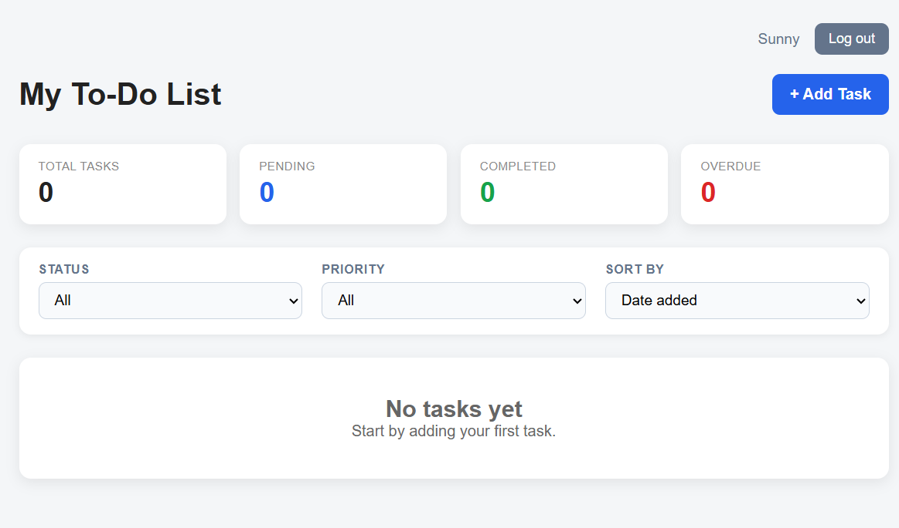

# CS2450: Task Manager
A comprehensive task management solution tailored for the modern college student. This application bridges the gap between academic deadlines, personal wellness, and professional growth in one unified dashboard.



## Table of Contents
- [CS2450: Task Manager](#cs2450-task-manager)
  - [Table of Contents](#table-of-contents)
  - [Key Features](#key-features)
  - [Getting Started](#running-the-project)
  - [Installation \& Setup](#installation--setup)
  - [Logging \& Observability](#logging--observability)
  - [Testing \& Coverage](#testing--coverage)
  - [Dependencies](#dependencies)
  - [Group 4 Contributors](#group-4-contributors)

## Key Features
- **Academic Tracking**: Organize tasks by priority, due date and status.
- **Restful API**:  Powered by Django REST Framework for seamless integration.
- **Structured Logging**: Meaningful traceability for debugging and maintenance.

## Getting Started
**Prerequisites**

- **Python**: 3.8 or higher.
- **pip**: Package management tool.

## Installation & Setup
```bash
# Open a terminal (Command Prompt or PowerShell for Windows, Terminal for macOS or Linux)

# Ensure Git is installed
# Visit https://git-scm.com to download and install console Git if not already installed

# Clone the repository
git clone https://github.com/whereswaldo93/CS2450-group4

# Navigate to the project directory
cd task_manager_app/

# Install dependencies
pip install -r requirements.txt

# Navigate to the server directory
cd task_manager_app/src/taskproject

# Run a local server
py manage.py runserver
```

## Logging & Observability
To ensure the application is maintainable and easy to debug, we using the following structured logging system.

**Log Levels & Usage**

| **Level** | **Usage Criteria** |
| --------- | ------------------ |
| **DEBUG** | Granular details for developers (e.g. raw API payloads and internal state)|
| **INFO**  | Key lifecycle events (e.g. App startup, successful DB writes, and user actions) |
| **WARNING** | Handled errors or unexpected behavior (e.g. failed logins and slow responses) |
| **ERROR** | Significant functional failures (e.g. database connection issues and 500 errors) |
| **CRITICAL** | System-wide failures (e.g. server unable to start) |

---
## Testing & Coverage   

**Running Unit Tests**

  To run all unit tests, use the following command: 
```bash
  python -m unittest discover -f
```

**Running Coverage Tests**

To run tests with coverage measurement, follow these steps:

1. **Install the `coverage` package if not already installed**:
```bash
   pip install coverage
```
   
2. **Run tests with coverage**:
```bash
   coverage run -m unittest discover -s task_manager_app/tests -p "*.py"
```

3. **Generate a coverage report**:
`coverage report`

4. **Generate an HTML report for detailed coverage**:
`coverage html`

---

## Dependencies
- **Django**: `Django>=5.0,<6.1`
- **Django REST framework**: `djangorestframework>=3.14,<4.0`
- **Production server**: `gunicorn>=21.0`
- **Environment Management**: `python-dotenv>=1.0,<2.0`
- **JSON Logging**: `python-json-logger`

## Group 4 Contributors
  - Javi Gutierrez, Kyle Bluemel, Jake Michie and Osvaldo Saldana
---

[Back to top](#cs2450--task-manager)

